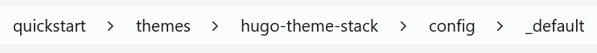
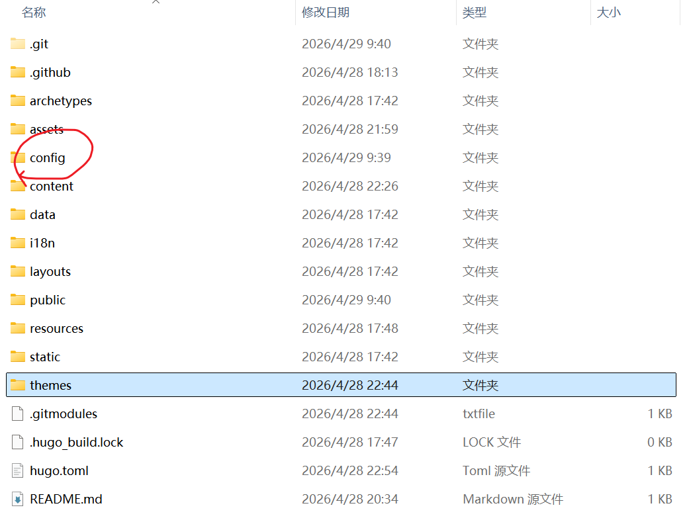
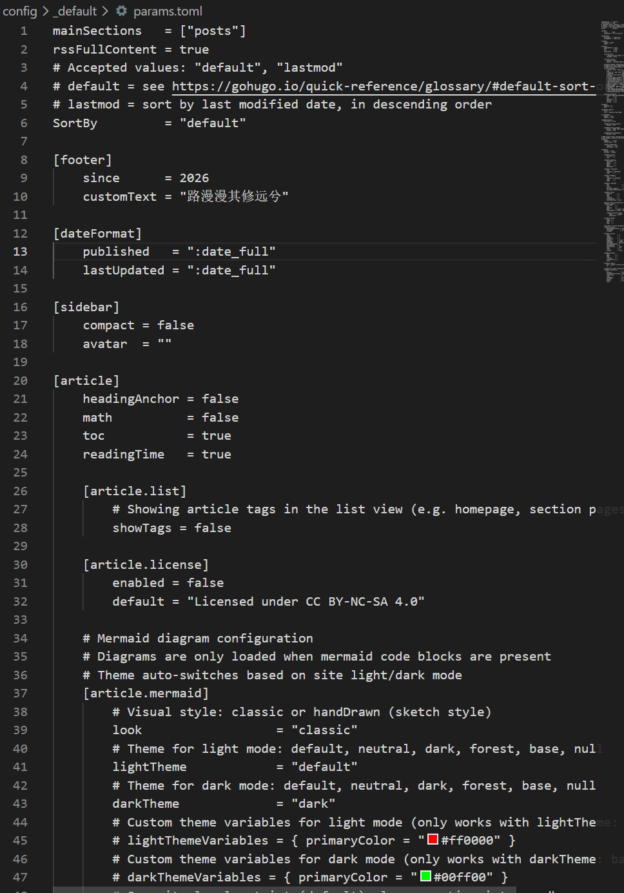

# 安装Hugo

[官方安装教程](https://gohugo.io/installation/)
我这里直接用包管理器安装了，电脑是windows,其他系统请自行参考。
Winget 是微软官方的免费开源 Windows 包管理器。要安装 Hugo 的扩展版：
```
winget install Hugo.Hugo.Extended
```
To uninstall the extended edition of Hugo:
要卸载 Hugo 的扩展版：
```
winget uninstall --name "Hugo (Extended)"
```
# 安装主题
安装之后要选择一个主题，这里用Stack主题
```
git submodule add https://github.com/CaiJimmy/hugo-theme-stack/ themes/hugo-theme-stack
```
然后打开 hugo.toml，加上主题配置。
```
baseURL = "https://xxxx.work/"
languageCode = "zh-cn"
title = "我的博客"
theme = "hugo-theme-stack"
```
关于主题的配置什么的，需要你自己看主题文档，我这边只说明怎么设置主题里的内容怎么更改。
记住这个文件夹路径，把这个文件夹整体复杂一份粘贴到hugo根目录下


打开params.toml文件

在这里改。
