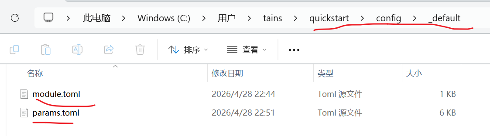

# 安装Hugo

[官方安装教程](https://gohugo.io/installation/)
我这里直接用包管理器安装了，电脑是windows,其他系统请自行参考。
Winget 是微软官方的免费开源 Windows 包管理器。要安装 Hugo 的扩展版：
```
winget install Hugo.Hugo.Extended
```
To uninstall the extended edition of Hugo:
要卸载 Hugo 的扩展版：
```
winget uninstall --name "Hugo (Extended)"
```
# 安装主题
安装之后要选择一个主题，这里用Stack主题
```
git submodule add https://github.com/CaiJimmy/hugo-theme-stack/ themes/hugo-theme-stack
```
然后打开 hugo.toml，加上主题配置。
```
baseURL = "https://xxxx.work/"
locale = "zh-CN"
title = "我的博客"
theme = "hugo-theme-stack"
```
关于主题的配置什么的，需要你自己看主题文档，我这边只说明怎么设置主题里的内容怎么更改。
记住这个文件夹路径，把这个文件夹整体复杂一份粘贴到hugo根目录下



打开params.toml文件

在这里改。不同主题自己参考以上内容。
# 部署上线
```
hugo server -D
```
-D 参数表示同时渲染草稿。启动后访问 http://localhost:1313 即可实时预览，修改文件会自动热更新，非常方便。
# 构建静态文件
```
hugo
```
Hugo 会在 public/ 目录下生成所有静态 HTML 文件，这就是最终要部署的内容。这些文件可以上传到你自己的云服务器或者使用Github Pages。
# 部署上线（以 GitHub Pages 为例）
这是目前最主流的免费托管方式，步骤如下：
1.​ 在 GitHub 上新建一个仓库，命名为 <你的用户名>.github.io
2.​ 将本地博客推送到该仓库：
```
git remote add origin git@github.com:<你的用户名>/<你的用户名>.github.io.git
git add .
git commit -m "init blog"
git push -u origin main
```
3.​ 在仓库的 Settings → Pages 中，将 Source 设置为 GitHub Actions，然后在项目根目录创建 .github/workflows/hugo.yml 文件，内容如下（官方推荐的自动构建配置）：
```
name: Deploy Hugo site to Pages

on:
  push:
    branches: [main]

permissions:
  contents: read
  pages: write
  id-token: write

jobs:
  build:
    runs-on: ubuntu-latest
    steps:
      - uses: actions/checkout@v4
        with:
          submodules: recursive
      - name: Setup Hugo
        uses: peaceiris/actions-hugo@v3
        with:
          hugo-version: 'latest'
          extended: true
      - name: Build
        run: hugo --minify
      - name: Upload artifact
        uses: actions/upload-pages-artifact@v3
        with:
          path: ./public

  deploy:
    needs: build
    runs-on: ubuntu-latest
    environment:
      name: github-pages
    steps:
      - name: Deploy to GitHub Pages
        uses: actions/deploy-pages@v4
```
之后每次 git push，GitHub Actions 都会自动构建并发布，访问 https://<你的用户名>.github.io 即可看到你的博客。
# 更新博客内容
以后每次更新博客，标准流程是：
```
git add .
git commit -m "新增文章：xxx"
git push
```